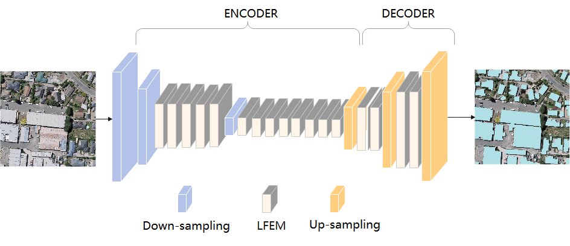

# ELRNet：A Novel Lightweight Network for Building Extraction from High-Resolution Remote Sensing Images

Here, we provide the pytorch implementation of the paper: Research on Building Extraction from VHR Remote Sensing
Imagery Using Efficient Lightweight Residual Network.



## Clone this Repository
```
git clone https://github.com/GaoAi/ELRNet.git
cd ./ELRNet
```

## Virtual Environment Creation (if you need it)
```
conda create -n elrnet python==3.8
conda activate elrnet
```

## Installation
```
- python
- pytorch
- torchvision
- cudatoolkit
- cudnn
- visdom
- pillow
- tqdm
- opencv
- pandas
```

## Dataset
You can take the public WHU building extraction dataset as an example for training and testing. 
### Dataset Directory Structure
```
Directory:
            #root | -- train | -- image 
                             | -- label 
                  | -- val | -- image 
                           | -- label    
                  | -- test | -- image 
                            | -- label
                  | -- save | -- {model_name} | -- datetime | -- ckpt-epoch{}.pth.format(epoch)
                            |                               | -- best_model.pth
                            |
                            | -- log | -- {model_name} | -- datetime | -- history.txt
                            | -- test| -- log | -- {model_name} | --datetime | -- history.txt
                                     | -- predict | -- {model_name} | --datetime | -- *.png/tif

```
Note: The save directory is automatically generated after the model starts training.

## Training
### Configure config.cfg
1. set `root_dir` to your dataset directory,For example `root_dir = /home/ELRNet/WHU_Building_dataset`
2. set `nb_classes` to be the number of class in your dataset.
3. set `epochs` to control the length of the training phase.
### Start training
（1）start visdom server
```
python -m visdom.server -env_path='./visdom_log/' -port=8096（The setting of `port` is in `train.py`）
```

（2）start train
```
python train.py
```
`-env_path` is where the visdom logfile store in, and `-port` is the port for `visdom`. You could also change the `-port` in `train.py`.


**If my work give you some insights and hints, star me please! Thank you~**
